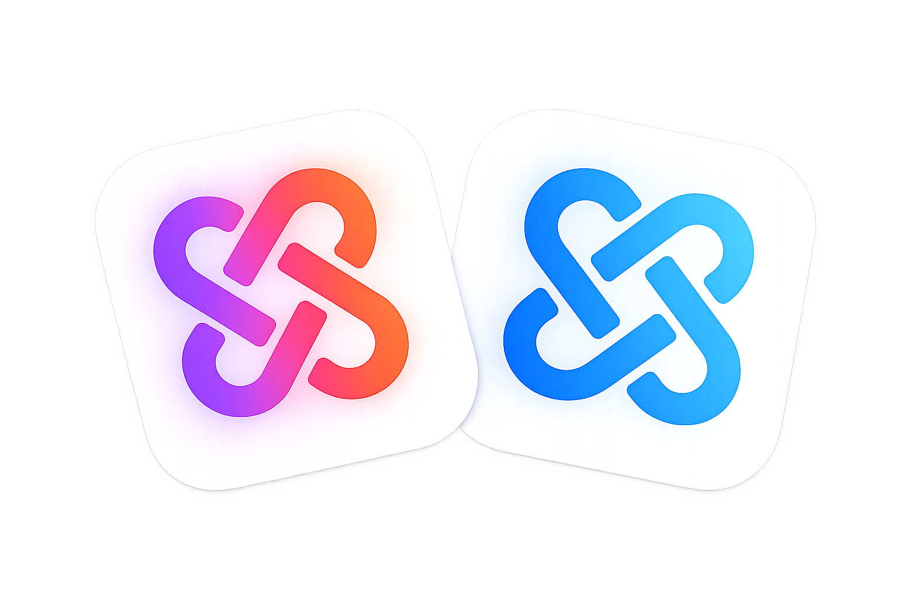
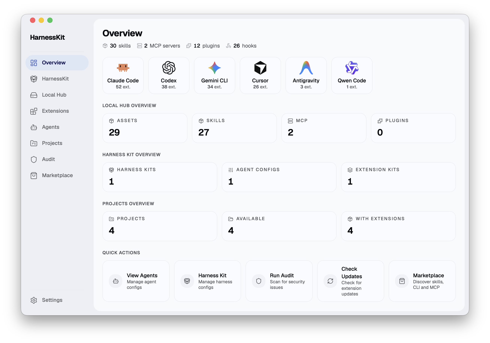

<p align="center">
  
</p>

<h1 align="center">HarnessKit</h1>

<p align="center">
  <strong>所有 Agent，一处管理。</strong><br/>
  免费、开源的一站式平台，统一管理你所有的 AI 编程 Agent —— 覆盖桌面、CLI、Web 三端。
</p>

<p align="center">
  <a href="LICENSE"></a>
  <a href="#快速开始"></a>
</p>

<p align="center">
  <a href="#为什么选择-harnesskit">为什么</a>&nbsp;&nbsp;&bull;&nbsp;&nbsp;<a href="#核心特性">核心特性</a>&nbsp;&nbsp;&bull;&nbsp;&nbsp;<a href="#快速开始">快速开始</a>&nbsp;&nbsp;&bull;&nbsp;&nbsp;<a href="#项目结构">项目结构</a>&nbsp;&nbsp;&bull;&nbsp;&nbsp;<a href="#未来计划">未来计划</a>
</p>

<br/>

<p align="center">
  
</p>

<br/>

## 为什么选择 HarnessKit？

每个 Agent 都自成体系。扩展、配置、记忆、规则分散在各自的目录中，格式与约定各异。

**HarnessKit 将它们集中到一处** —— 在同一界面内，看清、把控、统管你所有的 Agent。

<p align="center">
  
</p>

---

## 核心特性

### 🧩 全套扩展管理

HarnessKit 通过统一界面管理 **全部五种扩展类型** —— **Skill**、**MCP Server**、**Plugin**、**Hook** 与 **Agent-first CLI**。

<div align="center">

| Agent           | Skill | MCP | Plugin | Hook | Agent-first CLI |
| :----------------| :-----:| :---:| :------:| :----:| :---------------:|
| **Claude Code** | ✓     | ✓   | ✓      | ✓    | ✓               |
| **Codex**       | ✓     | ✓   | ✓      | ✓    | ✓               |
| **Gemini CLI**  | ✓     | ✓   | ✓      | ✓    | ✓               |
| **Cursor**      | ✓     | ✓   | ✓      | ✓    | ✓               |
| **Antigravity** | ✓     | ✓   | —      | —    | ✓               |
| **OpenCode**    | ✓     | ✓   | ✓      | —    | ✓               |
| **Trae**        | ✓     | ✓   | ✓      | ✓    | ✓               |
| **Trae CN**     | ✓     | ✓   | ✓      | ✓    | ✓               |
| **Qwen Code**   | ✓     | ✓   | ✓      | —    | ✓               |

<small><i>* "—" 表示该 Agent 目前不支持此扩展类型。</i></small>

</div>

- **分门别类** —— 按 *类型*、*Agent* 或 *来源* 筛选，按名称搜索。来自同一仓库的扩展会自动归为 *套装*，可批量管理。
- **一览无余** —— 每个扩展的 *所属 Agent*、*权限*、*信任评分* 与 *状态* 直接列在表格中。展开详情面板，每个 Agent 下的 *文件路径*、*目录结构* 与 *审计结果* 也都一目了然。
- **一键启停** —— 在列表中直接启用或禁用扩展，更新检查也只需一键。
- **跨 Agent 部署** —— 清晰显示该扩展在哪些 Agent 上已安装、哪些缺失，可一键补齐。HarnessKit 会自动适配不同 Agent 之间的格式差异（JSON、TOML、Hook 约定、MCP schema）。
- **作用域感知** —— 智能区分 **全局** 扩展与 **项目级** 扩展。查看项目环境时，全局资产会被清晰标记并分组展示。

<p align="center">
  <video src="media/extensions-demo.mp4" width="800" autoplay loop muted playsinline></video>
</p>

---

### 📦 Kits 与 HarnessKit 组合包

将 **Skill**、**MCP Server** 与 **CLI** 打包成带版本、可追溯的 **Kit** 扩展套件，或进一步组合 Kit 与 **Agent 配置模板** 成为一个 **HarnessKit 组合包**，一键同步到任意项目与 Agent。

- **扩展套件（Kit）** —— 从已安装扩展或 Local Hub 中挑选资产，组合成一个 Kit。Sync 时如果资产尚未备份到 Local Hub，系统会自动推送后再安装。
- **HarnessKit 组合包** —— 将多个 Kit 和 Agent 配置模板打包在一起。一次同步即可完成扩展安装 + 配置文件写入，适合团队标准化开发环境。
- **冲突解决** —— Sync 前自动预览冲突项（已存在的同名扩展、目标路径已有文件），可选择强制覆盖或跳过。
- **Agent 配置模板** —— 捕获、标记、版本化 Agent 配置文件（如 `CLAUDE.md`、`.codex/rules.md`），作为可复用模板同步到任意项目和 Agent。

<p align="center">
  <video src="media/harnesskit-demo.mp4" width="800" autoplay loop muted playsinline></video>
</p>

---

### 🗄️ Local Hub 本地备份中心

内置的本地备份中心，用于备份、同步与恢复扩展。

- **一键备份** —— 将任意 Agent 上的扩展备份到 Local Hub，跨 Agent、跨项目同步。
- **版本追踪** —— 每个备份条目独立存储，不会因 Agent 侧的修改而丢失。
- **恢复部署** —— 从 Local Hub 一键恢复扩展到任意 Agent 或项目。

<p align="center">
  <video src="media/localhub-demo.mp4" width="800" autoplay loop muted playsinline></video>
</p>

---

### 🤖 Agent 配置、记忆与规则

HarnessKit 统一管理每个 Agent 的 **配置**、**记忆**、**规则**、**子 Agent** 与 **忽略**（Ignore）文件。目前支持 **17 个 Agent**：**Claude Code**、**Codex**、**Gemini CLI**、**Cursor**、**Antigravity**、**GitHub Copilot**、**Windsurf**、**OpenCode**、**OpenClaw**、**CodeBuddy**、**Kimi Code CLI**、**Kilo Code**、**Kiro CLI**、**Trae**、**Trae CN**、**Qoder** 与 **Qwen Code**。

- **配置文件跟踪** —— 自动发现每个 Agent 的全局与项目级配置文件。添加项目目录或自定义路径后，HarnessKit 会将它们与全局配置一同纳入管理。
- **Agent 专属面板** —— 每个 Agent 拥有独立页面，文件按类别组织，列出范围、路径、文件大小以及已安装扩展的概览。展开任意文件即可在应用内预览。
- **自定义路径** —— 可将任意文件或文件夹加入某个 Agent 的面板进行跟踪。HarnessKit 未自动发现的自定义配置或脚本也能通过这种方式补充，并保持实时预览。
- **实时检测** —— 配置文件一旦发生变更，面板立即同步刷新。

<p align="center">
  <video src="media/agents-demo.mp4" width="800" autoplay loop muted playsinline></video>
</p>

---

### 📁 项目管理

注册项目目录后，HarnessKit 会自动发现该项目下各 Agent 的配置与扩展，纳入统一管理。

- **自动发现** —— 添加项目路径后，HarnessKit 扫描项目内的 Agent 配置文件（如 `.claude/`、`.cursor/`、`.github/copilot/`），自动关联到对应 Agent。
- **项目级视图** —— 在扩展列表和 Agent 面板中按项目筛选，清晰查看每个项目的扩展与配置情况。

<p align="center">
  <video src="media/projects-demo.mp4" width="800" autoplay loop muted playsinline></video>
</p>

---

### 🛡️ 安全审计与权限透明

内置安全引擎用 18 条静态分析规则逐个扫描扩展，给出 **信任评分**（0–100），分为三档 —— **安全**（80 分以上）、**低风险**（60–79）、**需复核**（60 分以下）。专属审计页面支持搜索、按等级筛选，可下钻到每一条发现。

- **一键审计** —— 一键对全部扩展执行完整安全扫描。面板会显示已扫描的扩展数量与最近一次审计时间。
- **精确到行** —— 每条审计发现都标明所在文件与行号，便于快速定位。
- **逐 Agent 扫描** —— 即便多个 Agent 共用同一扩展，每个 Agent 上的副本也会单独审计。因为版本之间可能存在差异，在某个 Agent 上判定为安全，并不意味着在其他 Agent 上同样安全。
- **权限透明** —— 每个扩展的权限按五个维度呈现：文件系统路径、网络域名、Shell 命令、数据库引擎、环境变量。在决定是否留用之前，你就能清楚知道它能触达哪些资源。

<p align="center">
  <video src="media/audit-demo.mp4" width="800" autoplay loop muted playsinline></video>
</p>

---

### 🏪 扩展市场

发现、评估、安装 —— 多个市场聚在一处，支持搜索、分类筛选与一键安装。

<p align="center">
  <video src="media/marketplace-demo.mp4" width="800" autoplay loop muted playsinline></video>
</p>

---

### ⚙️ 设置

统一管理与配置 HarnessKit 的各项全局参数与偏好设置。

<p align="center">
  <video src="media/settings-demo.mp4" width="800" autoplay loop muted playsinline></video>
</p>

---

## 快速开始

### 前置要求

- [Node.js](https://nodejs.org/) ≥ 18
- [Rust](https://rustup.rs/) 1.85+（edition 2024）
- [Tauri CLI](https://tauri.app/)（仅桌面开发需要）：`cargo install tauri-cli --version "^2.0.0"`

### Web 模式开发（macOS / Linux / Windows）

两个终端 —— Vite 开发服务器 + Rust 后端：

```bash
# 终端 A
npm install
npm run dev                                  # http://localhost:1420 (HMR)

# 终端 B
cargo run -p hk-cli -- serve                 # http://127.0.0.1:7070
```

浏览器打开 `http://localhost:1420`。Vite 会将 `/api/*` 请求代理到 `:7070` 后端。

### 桌面应用开发（macOS）

```bash
cargo tauri dev
```

Tauri 会自动运行 `npm run dev` 作为 before-dev 命令，并启动原生窗口。

### 构建发布

```bash
# macOS（双架构 + CLI）
./build.sh

# 仅 CLI（任意平台）
npm run build                          # 生成 dist/ 供 rust-embed 嵌入
cargo build --release -p hk-cli        # 输出 target/release/hk
```

---

## 项目结构

```
crates/
├── hk-core/         共享核心：扫描、模型、数据库、Agent 适配器
├── hk-desktop/      Tauri 桌面应用（封装 hk-core + 前端）
├── hk-cli/          CLI 二进制（hk）；含 `hk serve` Web 模式
└── hk-web/          Web 模式 HTTP 层（通过 rust-embed 嵌入 hk-cli）

src/                 React 前端（桌面应用与 Web 模式共用）
├── pages/           路由页面（Overview、Agents、Extensions、Marketplace、Audit、Settings 等）
├── components/      共享 UI 组件
├── stores/          Zustand 状态管理
├── hooks/           自定义 React Hooks
└── lib/             工具函数、API 客户端、类型定义
```

### 技术栈

- **前端**：React 19、TypeScript、Tailwind CSS 4、Zustand、Lucide Icons
- **后端 / 桌面**：Rust（edition 2024）、Tauri v2
- **CLI**：Rust 二进制，同时可作为独立 CLI（`hk`），嵌入前端以 Web UI 方式服务

---

## 测试

```bash
npm test                    # 前端测试（vitest）
cargo test --workspace      # Rust 测试
```

---

## 贡献

欢迎贡献！请参阅 [CONTRIBUTING.md](CONTRIBUTING.md) 了解开发流程与提交规范。

---

## 未来计划

- [ ] 更多 Agent 支持
- [ ] 扩展市场增强（评分、评论、推荐）
- [ ] 团队协作与配置共享
- [ ] 自定义审计规则

---

## 许可证

[Apache License 2.0](LICENSE)

---

*fork from https://github.com/RealZST/HarnessKit*
