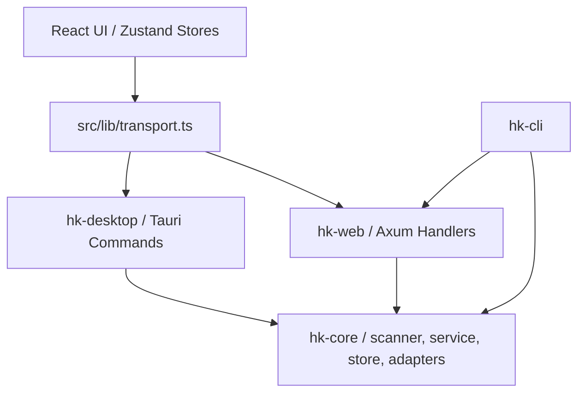

# HarnessKit 二次代码评审报告

审查日期：2026-05-27
审查范围：`docs/code_review_report.md`、`.understand-anything/`、`docs/superpowers/` 架构设计文档、前端 `src/`、后端 `crates/`、发布与 Tauri 配置
审查目标：验证整体架构是否足够支撑 macOS / Windows / Web 多端兼容，检查样式复用、方法复用、无用代码和近期迭代产生的脏代码。

## 0. 审查结论

整体架构方向是成立的：前端通过 `src/lib/transport.ts` 抽象 Tauri IPC 与 Web HTTP，后端通过 `hk-core` 承载共享业务，再由 `hk-desktop` 与 `hk-web` 作为不同运行端适配层。这条主线适合继续支持 macOS、Windows 与 Web。

但当前还不建议把多端兼容视为已经完成。二次审查发现 3 个需要优先处理的具体问题：

1. Windows 关闭窗口会被错误地拦截并隐藏，且没有系统托盘兜底。
2. Web 模式仍绑定了 Tauri 窗口拖拽事件，用户点击页面空白区域可能触发不可用的 Tauri API。
3. 前端 Git URL 校验和后端校验不一致，`ssh://`、`file://` 在后端允许但 UI 入口会提前拒绝。

旧报告里关于 CSS 主题重复、Update 双套实现、大文件和平台判断散布的判断基本成立。但旧报告中“Windows 仅 CSS 覆写、缺少平台配置”的表述需要修正：当前仓库已经存在 `crates/hk-desktop/tauri.windows.conf.json`，并且 macOS 配置已拆到 `tauri.macos.conf.json`。真正的问题不是“没有 Windows 配置文件”，而是部分运行时行为没有按平台隔离。

`.understand-anything/` 当前只有 `config.json` 和 `.understandignore`，没有可用于审查的生成文档。因此本报告没有引用 understand-anything 的架构输出，而是使用现有 `docs/superpowers/` 设计文档和源码做二次审查。

## 1. 架构复核

### 1.1 当前架构



优点：

- `transport()` 用 Tauri 注入对象检测 Desktop / Web，并把 Web 请求统一转成 `/api/{command}`。
- `hk-core` 是真实业务核心，`scanner.rs`、`service.rs`、`store.rs`、`manager.rs` 等模块被 Desktop 和 Web 共用。
- Windows 扫描问题已有专门设计文档约束：`scanner::scan_all()` 仍是资产发现的单一事实来源，前端不应从可见配置文件推导扩展数量。
- Release hardening 设计已经把 macOS 未签名测试包、Windows installer 与 CLI 产物语义拆开，方向正确。

主要风险：

- 平台能力判断分散在 UI、store、Tauri main、CSS 中，缺少一个统一的 platform capability 层。
- `hk-desktop/src/commands/*` 与 `hk-web/src/handlers/*` 命令/handler 成对存在，部分逻辑仍重复，需要继续把通用业务下沉到 `hk-core::service`。
- `scanner.rs`、`store.rs`、`service.rs` 都超过 3000 行，已经是后端维护风险点。它们目前不是 bug 本身，但会放大后续多端修复的回归风险。

## 2. 必须修复的问题

### P1 - Windows 关闭窗口行为被 macOS 逻辑误伤

证据：

- `crates/hk-desktop/src/main.rs:131-136` 在所有平台的 `CloseRequested` 事件中执行 `window.hide()` 并 `prevent_close()`。
- 旁边注释写的是 “Hide instead of quit on macOS red X”，但 `#[cfg(target_os = "macos")]` 只包住了后面的 `RunEvent::Reopen`，没有包住 close handler。
- `rg tray` 没有发现系统托盘实现。

影响：

- Windows 用户点击窗口关闭按钮时，应用会隐藏而不是退出。
- 因为没有托盘入口，用户可能无法感知应用仍在后台运行，也难以恢复窗口。
- 这与 Windows 原生交互预期冲突，是明确的多端兼容问题。

建议：

- 将 hide-on-close 限定到 macOS：`#[cfg(target_os = "macos")]`。
- Windows 保持默认 close 行为，除非先实现托盘和显式 “minimize to tray” 设置。
- 增加最小平台行为测试或手动验证清单：macOS red X 隐藏、dock reopen 恢复；Windows close 退出或进入托盘但必须可恢复。

### P1 - Web 模式仍绑定 Tauri 窗口拖拽 API

证据：

- `src/components/layout/app-shell.tsx:1` 静态 import `getCurrentWindow`。
- `src/components/layout/app-shell.tsx:69-101` 无条件注册 `mousedown` / `dblclick`，并在点击非 `main/nav` 区域时调用 `getCurrentWindow().startDragging()` 和 `toggleMaximize()`。
- `src/App.tsx:126-131` 已经会给 Web 模式设置 `data-web="true"`，说明同一 UI 会在非 Tauri 浏览器中运行。

影响：

- Web 模式下用户点击 sidebar 外的壳层空白、页面 padding、或其它不在 `main/nav` 内的区域时，可能调用不存在或不可用的 Tauri window API。
- 这破坏了 `transport.ts` 想要达成的 “Web 和 Desktop 共享 UI” 边界。

建议：

- AppShell 不直接 import Tauri window API。
- 新增 `lib/platform/window.ts`，提供 `startDragging()`、`toggleMaximize()`，内部先判断 `isDesktop()` 再动态 import。
- 或者最小修复：AppShell 内部 import `isDesktop()`，Web 下不注册窗口拖拽事件。

### P1 - Git URL 校验前后端不一致

证据：

- 前端 `src/lib/invoke.ts:40-47` 只允许 `https://`、`git://`、`git@`。
- 后端 `crates/hk-core/src/sanitize.rs:80-91` 明确允许 `https://`、`git://`、`git@`、`ssh://`、`file://`。
- 后端错误信息 `crates/hk-core/src/sanitize.rs:93-95` 仍然只提示 `https://, git://, ssh://, or git@`，遗漏了实际允许的 `file://`。

影响：

- 用户无法通过前端安装 `ssh://` 私有仓库或 `file://` 本地 Git 仓库，但直接调用后端是允许的。
- 同一个业务规则在两个语言层重复实现，后续还会继续漂移。

建议：

- 前端删除协议白名单校验，只做非空校验，把安全校验交给后端。
- 如果仍保留前端快速反馈，则协议白名单必须从后端规则同步，并修正后端错误文案。
- 增加 `invoke` 层或安装表单测试覆盖 `ssh://`、`file://`。

## 3. 高优先级可维护性问题

### P2 - CSS 主题变量重复严重

证据：

- `src/index.css:9-102` 定义默认 Tiesen light。
- `src/index.css:381-474` 又定义 `:root[data-theme="tiesen"]`，内容与默认 light 同构。
- `src/index.css:104-195` 定义默认 dark。
- `src/index.css:476-567` 又定义 `:root[data-theme="tiesen"].dark`，内容与默认 dark 同构。

影响：

- 修改 Tiesen 默认色时需要同步改两处，容易产生主题漂移。
- 新增主题时会诱导继续复制整块变量，而不是只覆盖差异。

建议：

- 保留 `:root` / `.dark` 作为 Tiesen 默认值。
- 删除显式 `tiesen` 重复块，或只保留极少量差异变量。
- 把跨主题不变量如字体、radius、spacing、agent/kind/toast 色放到一个共享层。

### P2 - Desktop / Web Update 组件和 store 是平行实现

证据：

- `src/App.tsx:68-73`、`src/App.tsx:167` 分别按 `isDesktop()` 调 `useUpdateStore` / `useWebUpdateStore` 和 `UpdateDialog` / `WebUpdateDialog`。
- `src/stores/update-store.ts:39-58` 与 `src/stores/web-update-store.ts:76-93` 的 state/action 结构高度相似，但字段名分别是 `showChangelog` 和 `showDialog`。
- `src/stores/web-update-store.ts:2` 还从 desktop store 复用 `cleanChangelog` 与 `DISMISS_KEY_PREFIX`，说明抽象边界已经混在一起。

影响：

- 新增一个 update UI 行为需要改两套组件、两套 store 和 App/Sidebar/Settings 的条件分支。
- Desktop/Web 差异本质上只是 “发现更新方式” 和 “确认动作”，不应复制整套展示层。

建议：

- 提取共享 `UpdateNotice` view model：`available`、`checking`、`dismissed`、`dialogOpen`、`prompt`、`dismiss`、`confirm`。
- Desktop 与 Web 只保留策略实现：Tauri updater vs GitHub release polling。
- UI 组件只消费统一接口。

### P2 - 平台判断与 Tauri API 入口散布

证据：

- `rg "isDesktop\\(" src` 显示 `App.tsx`、`settings.tsx`、agent/detail、extension/detail、install-dialog、file-tree-node、sidebar 等多处散布平台判断。
- `@tauri-apps/*` 静态 import 出现在 `App.tsx`、`app-shell.tsx`、`onboarding.tsx`、`local-hub.tsx`、`update-store.ts` 等文件。
- `src/lib/dialog.ts:6-33` 已经用动态 import 做降级，但其它平台 API 没有统一采用这个模式。

影响：

- Web 兼容由每个调用点自觉保证，漏一个就可能产生运行时问题。
- Windows/macOS 行为也缺少统一能力描述，例如 canDragWindow、canSetAppIcon、canOpenNativeDialog、closeBehavior。

建议：

- 新增 `lib/platform/`：
  - `runtime.ts`：`isDesktop`、`desktopPlatform`
  - `window.ts`：drag / maximize / theme / close behavior
  - `dialog.ts`：native picker + Web fallback
  - `updater.ts`：Desktop/Web update strategy
  - `opener.ts`：open/reveal
- UI 只依赖 capability，不直接依赖 Tauri 包。

### P2 - 超大文件仍然拖累模块边界

证据：

- `src/components/onboarding/onboarding.tsx` 1484 行。
- `src/pages/harnesskit.tsx` 1439 行。
- `src/pages/settings.tsx` 1429 行。
- `src/components/harness-kit/harness-kit-editor.tsx` 1155 行。
- `src/pages/marketplace.tsx` 1091 行。
- 后端 `crates/hk-core/src/scanner.rs` 3530 行、`store.rs` 3507 行、`service.rs` 3032 行。

影响：

- UI 迭代和 review 都很难限定影响面。
- 这些文件同时承载数据读取、状态派生、事件处理和渲染，容易把一次功能修改变成局部重写。

建议：

- 前端先拆 “纯 view model/helper + section/component”，不要先做大规模视觉重构。
- `settings.tsx` 可按 Agent、Theme、Update、Project、Data 分 section。
- `harnesskit.tsx` 可把 sync status、project selection、asset grouping、drawer orchestration 拆成 hooks。
- 后端优先从 `service.rs` 提取 Harness Kit / Kit Sync / Audit / Install service 子模块。

## 4. 中优先级问题

### P3 - `web-select.ts` 不是死代码，但命名已经误导

证据：

- 旧报告把 `web-select.ts` 标成可能 dead code。
- 实际 `src/pages/audit.tsx`、`src/components/extensions/extension-filters.tsx`、`src/components/shared/scope-target-field.tsx` 都引用了它。
- `src/lib/web-select.ts:19-23` 注释说明 `isWeb` 现在永远是 `true`，只是保留给调用方做 className gate。

影响：

- 这不是死代码，但 `isWeb` 常量永真会让调用方误以为还存在 Web/Desktop 分支。

建议：

- 改名为 `selectChromeStyle.ts` 或 `nativeSelectStyle.ts`。
- 删除永真 `isWeb` 分支，把调用方样式直接收敛到统一 select 样式。

### P3 - 文件选择器 Web 降级过弱

证据：

- `src/lib/dialog.ts:6-33` 在 Tauri dialog 不可用时只 `console.error` 并返回 `null`。
- `settings.tsx`、`agent-detail.tsx`、`config-file-entry.tsx`、`install-dialog.tsx` 都依赖该 picker。

影响：

- Web 模式里涉及本地路径选择的动作没有可见降级说明，也没有 `<input type="file">` / `<input webkitdirectory>` 替代。
- 用户只看到操作无结果，开发者只能从 console 看原因。

建议：

- 对 Web 明确返回 `unsupported` 状态，让调用方展示禁用态或解释性 toast。
- 如果 Web 端确实需要上传/导入本地文件，再单独实现 HTML file input 流程，不要把 path picker 当成通用接口。

### P3 - `puppeteer` 放在生产 dependencies

证据：

- `package.json:20-39` 中 `puppeteer` 位于 `dependencies`，不是 `devDependencies`。

影响：

- 桌面/Web 安装依赖会额外拉取体积很大的浏览器自动化包。
- 如果它只用于测试、截图或生成媒体，应放在 devDependencies 或移到独立脚本环境。

建议：

- 先确认生产运行是否真的 import puppeteer。
- 若没有生产 import，迁移到 `devDependencies`。

### P3 - `types.ts` 领域边界过宽，但其中的跨平台 helper 有保留价值

证据：

- `src/lib/types.ts` 当前约 730 行，同时包含 Extension、Agent、ConfigScope、Marketplace、Kit、Harness Kit sync 等多个领域模型。
- 同一文件中也包含路径归一化和 scope helper：`normalizePathForComparison()`、`pathsEqual()`、`scopeKey()`，见 `src/lib/types.ts:232-261`。
- Agent 元数据也在这里集中管理：`AGENT_ORDER`、`sortAgents()`、`agentDisplayName()`，见 `src/lib/types.ts:313-370`。
- UI 展示 helper 也混在类型文件中：`trustTier()`、`trustColor()`、`severityColor()`、`formatRelativeTime()`，见 `src/lib/types.ts:478-520`。

影响：

- 作为类型入口它很方便，但修改 Harness Kit sync 类型、Agent 展示顺序、trust UI 色值都会 touch 同一个大文件。
- 路径归一化 helper 对 Windows / macOS 兼容很关键，应保留统一实现，不应随领域拆分被复制到各处。

建议：

- 保留 `normalizePathForComparison()` / `pathsEqual()` / `scopeKey()` 这类跨平台 helper 的单一事实来源。
- 将 UI 展示 helper 移到 `lib/utils/format.ts`、`lib/utils/trust.ts` 或同等位置。
- 将领域类型逐步拆成 `extension`、`agent`、`kit`、`marketplace`、`scope` 等文件，通过 `lib/types/index.ts` re-export，避免一次性大迁移。

### P3 - 错误处理是可复用优势，但还没有覆盖到所有静默失败点

证据：

- `src/lib/error-types.ts:1-80` 定义了结构化 `HkErrorKind`、`parseError()` 和 `isRetryable()`。
- `src/lib/errors.ts:10-19` 先把 raw error 解析成结构化错误，再走 kind-based message，最后 fallback 到字符串启发式。
- `src/lib/errors.ts:22-47` 覆盖 Network、NotFound、PermissionDenied、PathNotAllowed、ConfigCorrupted、Database、CommandFailed、Conflict、Validation。
- `src/lib/errors.ts:50-103` 还补了网络、git clone、权限、404、timeout、磁盘空间、重复安装等 legacy 字符串处理。

影响：

- 这套错误处理值得保留为前端错误展示的统一入口。
- 但当前仍有一些路径直接 `console.error` 或静默 catch，例如 picker fallback、update check、background scan，用户不一定能看到可操作反馈。

建议：

- 把 `humanizeError()` 接入更多用户触发的操作失败路径。
- 对后台非关键任务继续允许静默失败，但用户主动点击的动作应至少 toast 或禁用说明。

### P3 - 测试覆盖结论需要修正，缺口应聚焦到 Transport / Platform 层

证据：

- 当前 `src/**/__tests__` 下共有 35 个前端测试文件，覆盖 pages、components、stores、lib 多个层次。
- 已有 `src/lib/__tests__/error-types.test.ts`、`errors.test.ts`、`types.test.ts`、`install-surface.test.ts`，以及 Harness Kit / Agent Config Hub / Local Hub 等组件测试。
- 但未看到专门覆盖 `transport.ts` Desktop/Web 分支、`AppShell` Web 下 window API 隔离、Git URL 前后端协议一致性的测试。

影响：

- 原报告“pages 仅 1 个测试文件”的说法已经不准确。
- 真正的风险不是总体测试数量太少，而是多端兼容边界缺少 focused regression tests。

建议：

- 增加 `transport` mock 测试：Tauri branch 不做 snake_case，HTTP branch 做 snake_case 并带 auth header。
- 增加 platform/window 测试：Web 下不调用 Tauri window API。
- 增加 install/invoke 测试：`ssh://`、`file://` 与后端规则一致。

### P3 - Web release URL 硬编码会增加发布维护成本

证据：

- `src/stores/web-update-store.ts:4-5` 将 GitHub latest release API 写死为 `https://api.github.com/repos/RealZST/HarnessKit/releases/latest`。

影响：

- repo owner/name 迁移、fork 发布、企业部署或私有发布源都会需要改代码。
- 它和桌面 updater 的配置来源不一致，属于发布配置漂移风险。

建议：

- 将 release repo/source 提升为构建期常量或统一 update 配置。
- 至少和 package/version/release workflow 中的发布目标保持单一配置来源。

## 5. 原报告复核矩阵

| 原报告条目 | 二次核实结果 | 是否纳入最终报告 |
|---|---|---|
| Transport + `hk-core` 共享架构 | 成立。`transport.ts`、`hk-desktop`、`hk-web`、`hk-core` 的主线清晰。 | 已纳入架构复核。 |
| CSS 主题重复 | 成立。Tiesen 默认 light/dark 与显式 Tiesen selector 重复。 | 已作为 P2。 |
| Desktop/Web Update 双套实现 | 成立。store 与 dialog/card 命名、状态结构重复。 | 已作为 P2。 |
| State 管理整体良好，但 `extension-store` 偏重 | 基本成立。`extension-helpers.ts` 已分担纯函数，但 store 仍承载 CRUD、选择、更新、删除等职责。 | 已保留在大文件/模块边界与整改顺序中。 |
| 超大页面文件 | 成立。多个前端文件超 1000 行，后端核心文件也超过 3000 行。 | 已作为 P2。 |
| AppShell 直接使用 Tauri window API | 成立，但表述修正为运行时交互风险，不是单纯模块解析风险。 | 已作为 P1。 |
| `isDesktop()` 与 Tauri API 散布 | 成立。 | 已作为 P2。 |
| `types.ts` 拆分 | 成立，但需保留路径/scope helper 单一事实来源。 | 新增 P3。 |
| 错误处理优秀 | 成立。 | 新增 P3 架构优势与适用边界。 |
| Windows 仅 CSS 覆写、缺少平台配置 | 部分不成立。当前已有 `tauri.windows.conf.json` / `tauri.macos.conf.json`，真正问题是运行时行为没有隔离。 | 作为校正结论保留。 |
| `web-select.ts` 可能死代码 | 不成立。它有真实引用，但命名和 `isWeb = true` 需要清理。 | 已作为 P3。 |
| `puppeteer` 生产依赖 | 成立。 | 已作为 P3。 |
| 测试覆盖观察 | 原统计不准确。当前有 35 个前端测试文件，缺口集中在 Transport / Platform 兼容边界。 | 新增 P3。 |

## 6. 旧报告结论校正

旧报告中成立的部分：

- CSS 主题变量重复成立。
- Update Desktop/Web 双套实现成立。
- 超大文件问题成立。
- `types.ts` 同时包含类型和 helper，存在拆分空间。
- `extension-store.ts` 职责偏多，但已有 `extension-helpers.ts` 做了一部分纯函数提取。
- 错误处理的整体设计良好，值得继续作为统一用户错误文案入口。

需要修正的部分：

- “Windows 仅 CSS 覆写”不准确。仓库已有 `tauri.windows.conf.json` 和 `tauri.macos.conf.json`，平台配置已有拆分。
- “web-select.ts 可能是 dead code”不准确。它有真实引用，只是命名与永真常量需要清理。
- “AppShell 在 Web 模式静态 import Tauri API 可能模块解析失败”应改成更精确的风险：依赖包存在时构建可通过，但运行时交互仍可能调用不可用 window API。
- “测试覆盖集中且 pages 仅 1 个测试文件”不准确。当前前端测试文件总数为 35，缺的是 Transport / Platform / 协议一致性的 focused 测试。

## 7. 推荐整改顺序

1. 先修 P1 多端兼容问题：
   - macOS-only close handler。
   - AppShell Web 下不注册 Tauri window drag。
   - Git URL 校验前后端对齐。
2. 再做平台能力层：
   - 从 `dialog.ts` 模式扩展到 window、updater、opener。
   - 收敛 `isDesktop()` 散布。
3. 再做低风险复用清理：
   - CSS Tiesen 重复块。
   - Update UI/store 抽象。
   - `web-select.ts` 命名和永真分支。
4. 最后拆大文件：
   - 先前端页面/组件按 section 拆。
   - 后端按 service 子域拆，不改变公共 API。

## 8. 建议验证命令

修复前后建议跑：

```bash
npm test
npm run build
cargo test -p hk-core scanner -- --nocapture
cargo check -p hk-desktop
cargo check -p hk-web
```

跨端手动验证：

- macOS：关闭窗口应隐藏，Dock reopen 应恢复。
- Windows：关闭窗口应退出，或如果未来改为托盘模式，应能从托盘恢复。
- Web：点击 sidebar 外壳、页面空白、双击壳层不应触发 Tauri API 错误。
- Git 安装：`https://`、`git@`、`ssh://`、`file://` 的前后端接受/拒绝规则一致。

## 9. 最终判断

HarnessKit 的主架构可以支撑多端，但当前需要先把平台行为从组件和 Tauri main 中收拢出来。最危险的不是抽象不够漂亮，而是“看似 macOS-only 的行为实际跑在 Windows/Web 上”。先修 P1，再做复用清理，会比直接拆大文件更稳。

## 10. 本轮整改执行结果

本节记录基于本报告执行后的代码状态，分支为 `codex/review-remediation`，基线为 `main` 的 `0ec26ec`。

### 10.1 已完成整改

| 报告问题 | 整改状态 | 关键改动 |
|---|---|---|
| P1 macOS close-to-hide 泄漏到 Windows/Linux | 已修复 | `crates/hk-desktop/src/main.rs` 将 `hide + prevent_close` 限定为 macOS 条件编译。 |
| P1 React 组件直接依赖 Tauri window API | 已修复 | 新增 `src/lib/platform/window.ts`，组件改走平台边界；Web no-op，Tauri 动态 import 并安全转发。 |
| P1 Git URL 前后端校验不一致 | 已修复 | `src/lib/invoke.ts` 与 `hk-core::sanitize::validate_git_url` 对齐；desktop/web 的 scan/install-new-repo clone 入口也接入 validator。 |
| P2 Tiesen 主题变量重复 | 已修复 | `src/index.css` 删除与默认 light/dark 完全一致的显式 Tiesen 变量块，保留 web dark 专用覆盖。 |
| P3 `web-select.ts` 永真 `isWeb` 脏代码 | 已修复 | 删除 `isWeb = true` 与调用点死分支，保留仍被复用的 `webSelectStyle`。 |
| P3 web release/download URL 散落 | 已修复 | 新增 `src/lib/release.ts`，集中默认 URL 与 `VITE_HARNESSKIT_*` 覆盖入口。 |
| P3 `puppeteer` 位于 production dependencies | 已修复 | 移到 `devDependencies`，未升级版本。 |
| P3 Transport/Platform 边界测试缺口 | 已补强 | 增加 `transport.test.ts`、补充 release env 空值 fallback、平台 window 与 Git URL focused tests。 |

### 10.2 保留的非阻塞事项

- `src/lib/invoke.ts` / Rust validator 对 `ssh://`、`file://` 仍采用前缀级校验；本轮只收紧了明显过宽的 SCP-like `git@host:path`，未扩大为完整 URL parser，以避免改变既有后端 contract。
- Update desktop/web 双套实现、超大文件拆分、`types.ts` 拆分仍建议按后续独立计划推进。
- 全仓 Biome 仍存在历史 lint/organize-imports/rules-of-hooks 问题，本轮只对触达文件做 focused 校验。

### 10.3 实际验证结果

已通过：

```bash
npm test
# 39 test files passed, 270 tests passed

npm run build
# TypeScript + Vite build passed; only existing chunk-size warning remains

cargo check -p hk-desktop -p hk-web
# passed; only existing dead_code warnings remain

npx biome check --formatter-enabled=false <touched frontend files>
# passed; one pre-existing noExplicitAny warning in onboarding.tsx remains
```

额外 focused 验证：

```bash
npm test -- src/lib/__tests__/invoke.test.ts
npm test -- src/lib/__tests__/platform-window.test.tsx src/lib/__tests__/invoke.test.ts src/lib/__tests__/release.test.ts src/lib/__tests__/transport.test.ts src/stores/__tests__/web-update-store.test.ts
cargo test -p hk-core validate_git_url
```

### 10.4 当前结论

本轮整改已经关闭最影响多端兼容的 P1 问题，并完成一组低风险复用和依赖收口。HarnessKit 目前的主架构更适合继续支撑 macOS、Windows 和 Web/Tauri 双运行时；后续重构应优先围绕 Update 能力层、大文件拆分和类型模块边界继续推进。
